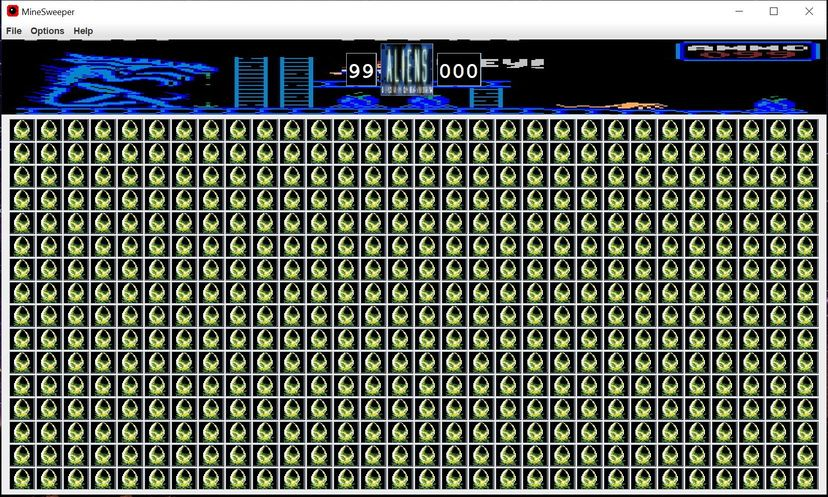

# MineSweeper_Java
A MineSweeper game written in Java
Contributors to this project: 
1. CHENG KUAN YONG, JASON
2. NG YE DONG

## About this game
The User Interface is programmed using Java toolkit. 
 

This game has 2 distinct themes to it: namely a Dark theme and a Horror theme, inspired by the Aliens movie.

### Win/Lose Condition

Winning condition is triggered when all non-mine tiles are pressed, or when all mines are correctly flagged.

Lose condition is triggered when the player clicks on a tile with a mine. 

### Difficulty levels
There are 3 different difficulties level to the game: Easy, Intermediate, and Difficult. The difficulty 
levels are set according to the number of cells and mines in the game.

 
For easy mode, there are 10 mines in a 10 x 10 tile map.

 
For intermediate mode, there are 40 mines in a 16 x 16 tile map.

For hard mode, there are 99 mines in a 16 x 30 tile map. 

## Image gallery
 
 
 
 
 
 

  